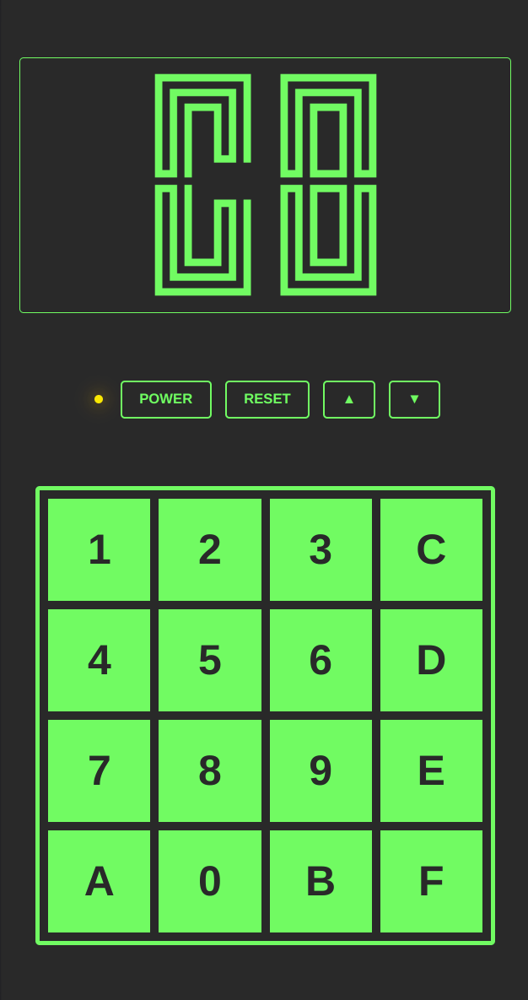

Developed by Joseph Weisbecker in the mid-1970s the [CHIP-8](https://en.wikipedia.org/wiki/CHIP-8) is an interpreted language that runs programs on a virtual machine. It is a great project to start learning hardware emulation and have fun in the process with the many programs written for this environment.

This version is developed with web technologies (HTML5, CSS3 and Javascript) and uses containers for the development and production environments. For development the code runs on a Node JS container with auto reloading via Docker. The production goes live on a Nginx container running on a single node Kubernetes deployed by a Github Actions workflow.

## Development Environment

```shell
docker-compose --file docker/compose.yml --project-name chip8 up
```

## Production Environment


https://chip8.joaorodriguesjr.com

[](public/screenshot.png)
