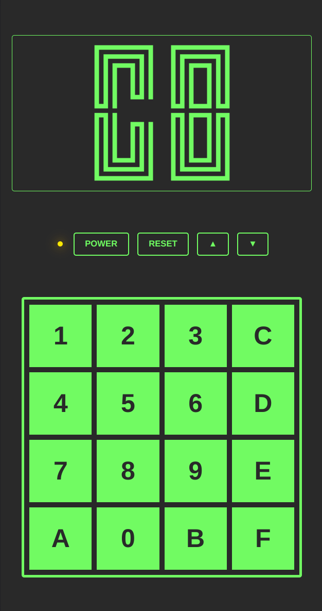

The [CHIP-8](https://en.wikipedia.org/wiki/CHIP-8) is a fun emulation project that serves as an introduction to the world of the emulators.

There are many game roms scattered around the internet to be played on your version of the virtual machine.



### Development Environment

```shell
docker-compose --file docker/compose.yml --project-name chip8 up
```
